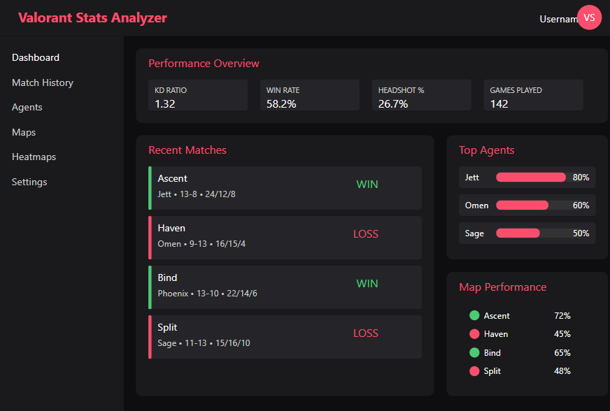

# Valorant Stats Analyzer

**Valorant Stats Analyzer** is a web-based application designed to help players analyze their personal performance in Valorant using Riot's official APIs and RSO (Riot Sign-On) authentication.

The app will allow users to securely log in with their Riot account and visualize detailed statistics from their recent matches. The goal is to help players track their progress, identify patterns in their gameplay, and improve over time.

---

## 🔍 Features (Planned)

- 📊 **Match History Viewer** – Display full details of recent matches (agents, map, score, kills/deaths, etc.)
- 💀 **Death Heatmaps** – See where you tend to die on each map
- 🧠 **Performance Insights** – Detect which agents you perform best with
- 📈 **Trend Analysis** – Track evolution of key stats over time
- 🗂️ **Secure Authentication** – Use Riot's RSO OAuth2 to protect player data and ensure privacy

---

## 🔐 How it works

1. Players authenticate via Riot's RSO (OAuth2)
2. The app retrieves the player's PUUID securely
3. Using `VAL-MATCH-V1` and related endpoints, we fetch match history
4. Data is visualized in charts, tables, and on interactive maps

---

## 🚧 Project Status

- ✅ GitHub Pages demo site published
- ⚙️ Currently building the backend logic
- 📌 Match parsing and data visualization in progress
- 📍 OAuth2 integration with Riot RSO planned for public testing

---

## 🖼️ Prototype Preview

### Application Architecture

### Dashboard Mockup

---

## ⚠️ Disclaimer

This project is under development and not affiliated with Riot Games.  
All data is retrieved via the official Riot Games API under their developer terms.
